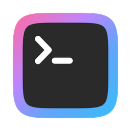
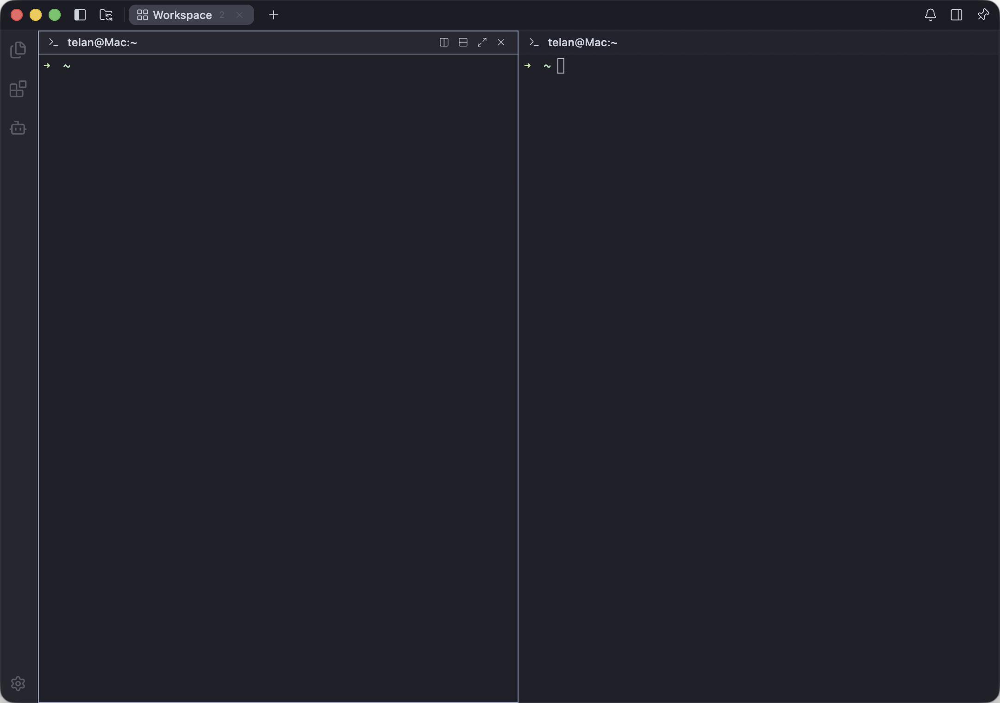
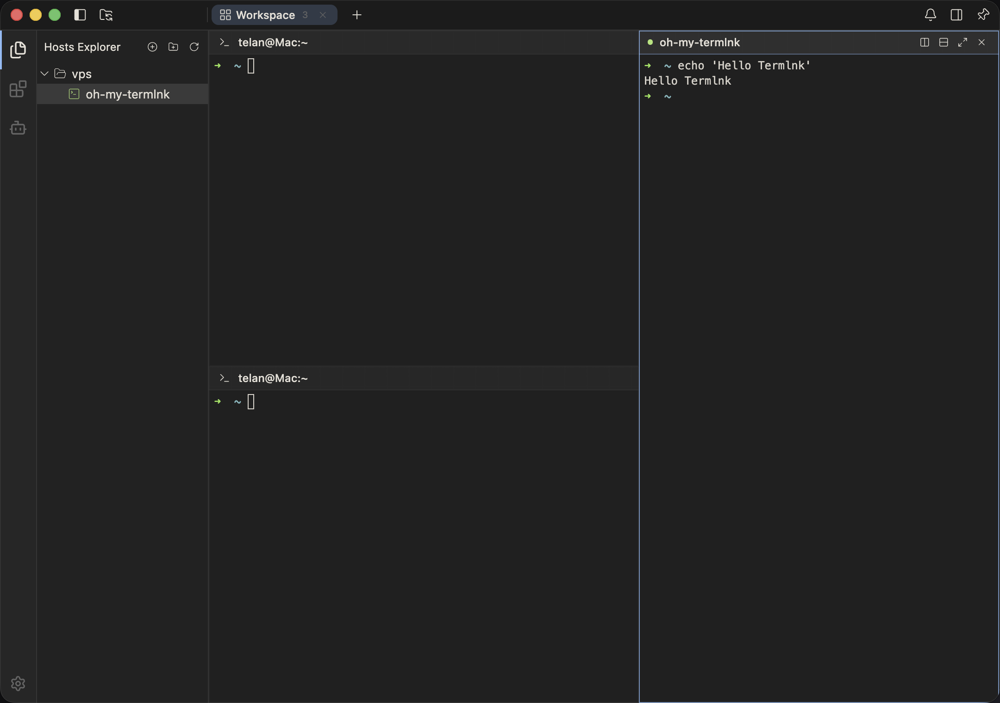
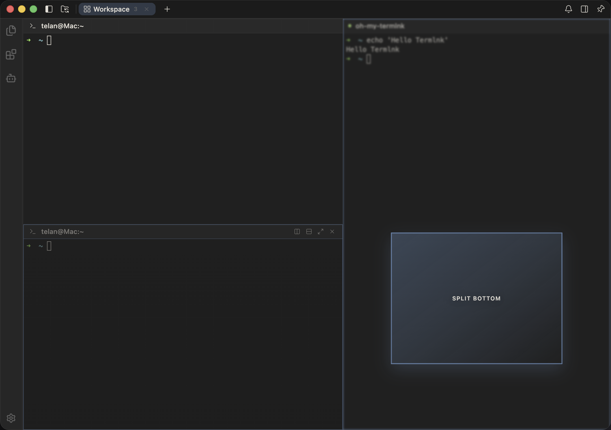
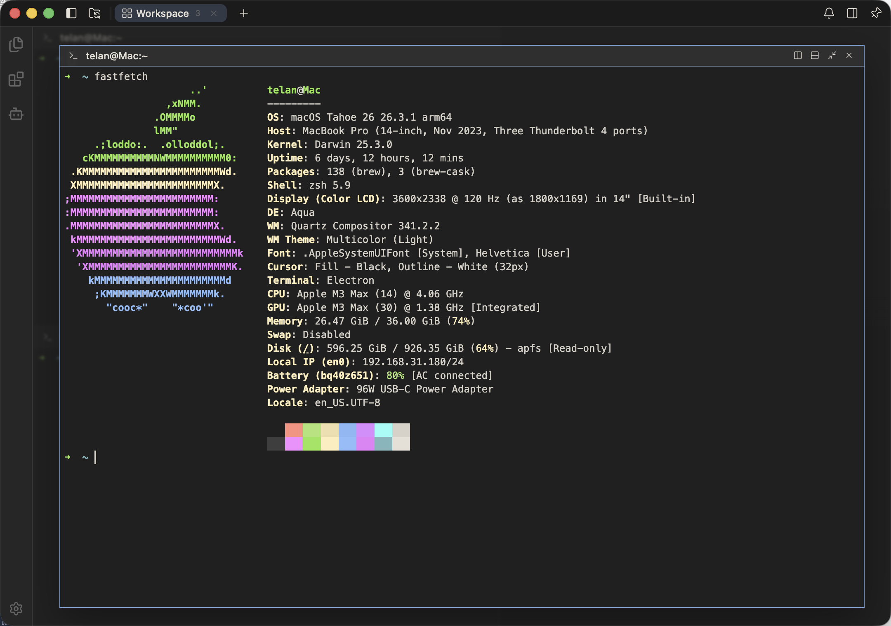
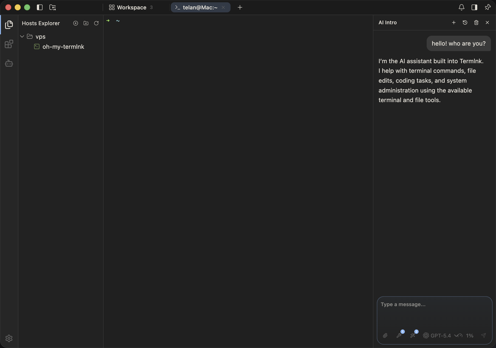
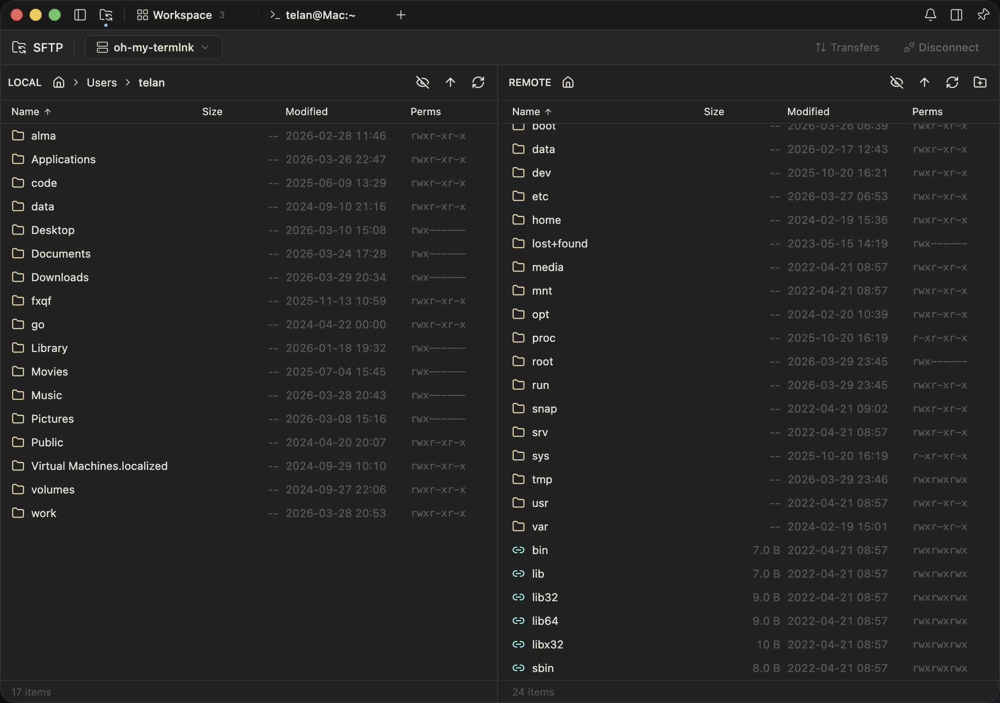
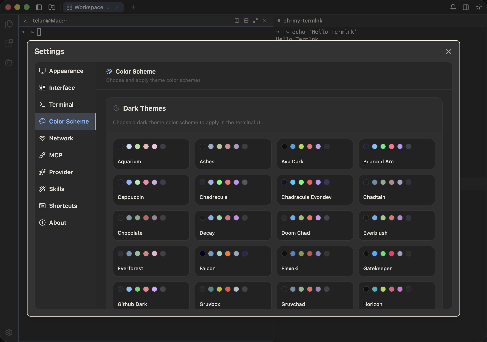
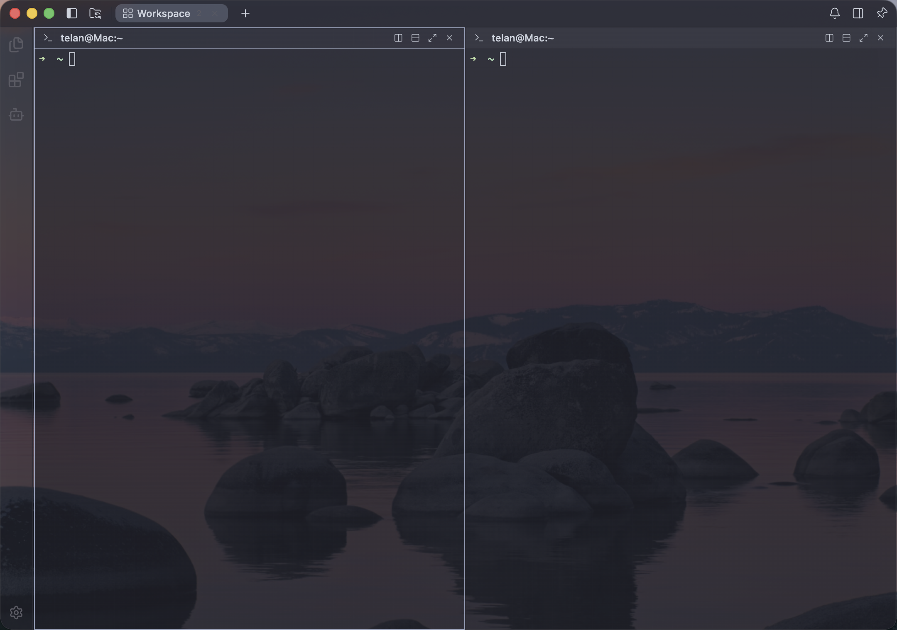

<div align="center">

<h1>
<br />
Termlnk
</h1>

開発者のためのモダンで拡張可能なスマートターミナル。<br />
**SSH &amp; SFTP &middot; 内蔵 AI &middot; スニペット &middot; ポート転送 &middot; デバイス間同期 &middot; 71 テーマ &middot; 拡張機能 &middot; クロスプラットフォーム。**

[English][readme-en-link] | [简体中文][readme-zh-cn-link] | [繁體中文][readme-zh-tw-link] | **日本語** | [한국어][readme-ko-link]

[![][license-shield]][license-link]
[![][release-shield]][releases-link]
[![][downloads-shield]][releases-link]
[![][platform-shield]][platform-link]

</div>

---

<p align="center">
  
</p>

<details open>
<summary>
<strong>目次</strong>
</summary>

- [🌈 ハイライト](#-ハイライト)
- [🚀 クイックスタート](#-クイックスタート)
- [💻 プラットフォームとインストール上の注意](#-プラットフォームとインストール上の注意)
- [🌐 Web 版セルフホスティング](#-web-版セルフホスティング)
- [🛠 開発](#-開発)
- [🌐 国際化](#-国際化)
- [📸 スクリーンショット](#-スクリーンショット)
- [🤝 コントリビュート](#-コントリビュート)
- [💬 コミュニティ](#-コミュニティ)
- [🙏 謝辞](#-謝辞)
- [📄 ライセンス](#-ライセンス)

</details>

## 🌈 ハイライト

Termlnk は、高速なスマートターミナル、SSH & SFTP クライアント、そしてコマンドを実行できる AI アシスタントを 1 つのアプリに統合しています。デスクトップにインストールしてそのまま使うことも、自分でバックエンドをホストしてブラウザから開くこともできます。

- 🖥 **すべてのターミナルを 1 つのウィンドウに集約** — ローカルシェルと SSH セッションを並べて開き、柔軟に分割、集中したいときは 1 つのペインを拡大。アプリを再起動しても、直前のワークスペースが自動的に復元されます。
- 🔐 **サーバー、鍵、ファイルを一元管理** — サーバーはフォルダ構造で整理でき、パスワード / 鍵 / SSH Agent でのログイン、および踏み台経由の接続に対応。デュアルペイン SFTP でリモートファイルをドラッグで転送できます。すべての SSH 鍵と接続履歴のあるホスト情報はキーチェーンページに集約されます。
- 🔀 **ポート転送** — ローカルサービスをリモートに公開する、リモートサービスをローカルに戻す、SSH 接続を SOCKS5 プロキシとして使う —— これらをすべて UI 上で設定し、ワンクリックで開始・停止できます。
- ✂️ **スニペット（Snippets）** — よく使うコマンドを保存してグループ管理。任意のセッションからワンクリックで実行できます。サーバーに紐付けると、接続成功時に自動実行することも可能です。
- 🤖 **AI Agent** — OpenAI / Claude / Gemini / DeepSeek / Qwen、および OpenAI 互換モデルを自由に切り替え可能。ユーザーの承認を得たうえでターミナルコマンドを実行し、長時間の会話でも文脈を維持します。
- ☁️ **デバイス間同期、エンドツーエンド暗号化** — サーバー、鍵、スニペット、ポート転送ルールを複数デバイス間で自動同期。データは端末で暗号化してから送信され、マスターパスワードはいつでも変更でき、変更後も既存データは問題なく読み取れます。
- 🔄 **アプリ内自動更新** — 新バージョンは設定画面からワンクリックで確認・ダウンロード・インストール。macOS・Windows・Linux に対応。
- 🧩 **拡張機能マーケット** — 拡張機能をワンクリックで追加し、コマンド・メニュー・サイドパネル・設定項目を拡充できます。開発者は安定した TypeScript API でカスタム拡張を作成できます。
- 🎨 **71 種のテーマ、カスタマイズも可能** — 71 種類のプリセットに加え、ライブプレビュー付きのテーマエディタを搭載。「Auto / Light / Dark」モードでシステムに合わせて明暗を自動切り替え。ブラー、透明度、フォント、キーバインドもすべてカスタマイズできます。
- 💻 **クロスプラットフォーム + オフラインファースト** — macOS（Intel と Apple Silicon）・Windows・Linux にネイティブインストーラーを提供。ネット接続がなくても使えます。
- 🌐 **ブラウザからも利用可能** — 同じアプリを Docker 1 コマンドで自分のサーバーにデプロイでき、自動 HTTPS も内蔵。以降はブラウザから開くだけで、デスクトップ版と同じ体験が得られます。
- 🏝 **macOS Dynamic Island** — ノッチ搭載の Mac では、上部のピル領域に AI アシスタントのリアルタイム状態が表示されます。開始・完了・承認待ち・エラーのサウンド通知にも対応。

## 🚀 クイックスタート

### ダウンロード

macOS、Windows、Linux（x64 と arm64）のビルド済みインストーラーは [GitHub Releases][releases-link] で公開されています。インストール後は設定画面からワンクリックで自動更新できます。

### ソースからビルド

```bash
git clone https://github.com/termlnk/termlnk.git
cd termlnk
pnpm install

cd apps/desktop
pnpm dev
```

### インストーラーをパッケージング

```bash
cd apps/desktop
pnpm make:mac      # macOS .dmg / .zip（x64 & arm64）
pnpm make:win      # Windows .exe / .msi（x64 & arm64）
pnpm make:linux    # Linux .AppImage / .deb / .rpm（x64 & arm64）
```

## 💻 プラットフォームとインストール上の注意

macOS 版は Developer ID 証明書で署名されていますが、Apple による公証は受けていないため、初回起動時に Gatekeeper の警告が表示される場合があります。Windows 版と Linux 版は署名されていません。

<details>
<summary>macOS：初回起動時の Gatekeeper 警告</summary>

**方法 1** — Finder で `Termlnk.app` を右クリック > 開く > 確認。

**方法 2** — システム設定 > プライバシーとセキュリティ > 「セキュリティ」までスクロール > 「このまま開く」をクリック。

**方法 3** — ターミナルで実行：

```bash
xattr -cr /Applications/Termlnk.app
```

</details>

<details>
<summary>Windows：SmartScreen がインストーラーをブロックする</summary>

**方法 1** — SmartScreen のダイアログで「詳細情報」をクリックし、続いて「実行」をクリック。

**方法 2** — 設定 > アプリ > アプリの詳細設定 > 「アプリをインストールする場所の選択」を任意のソースに設定。

</details>

## 🌐 Web 版セルフホスティング

**termlnk-web** は同じアプリのセルフホスト版で、ブラウザから利用できます。ターミナル・サーバー・AI アシスタント・SFTP の使用感はデスクトップ版とまったく同じで、デスクトップクライアントを起動する代わりに URL を開くという違いだけです。

> ⚠ **termlnk-web は信頼できるマシンでのみ運用してください。** マスターパスワードを保持し、あなたのサーバーへの接続、AI の呼び出し、ホストマシン上のファイル読み取りが可能で、デスクトップ版と同等の権限を持ちます。保護なしで公開インターネットに露出させないでください。

ビルド済みのマルチアーキテクチャイメージ（amd64 / arm64）が GHCR で公開されており、monorepo 全体を clone する必要はありません。

```bash
cd apps/web

# ワンクリック：強力な master password を生成 → イメージ取得 → 起動 → ヘルスチェック
./install.sh

# 自動 HTTPS（内蔵 Caddy + Let's Encrypt）：
./install.sh --tls termlnk.example.com
```

または Docker Compose で手動配置：

```bash
cd apps/web
printf '%s' 'choose-a-strong-passphrase' > master_password.secret && chmod 600 master_password.secret
docker compose up -d
```

ワンクリック / 手動配置、リバースプロキシ（Caddy / nginx）設定、環境変数、データ永続化、アップグレード、セキュリティチェックリストは **[termlnk-web デプロイガイド](../apps/web/README.md)** を参照してください。

## 🛠 開発

```bash
pnpm build          # すべてのライブラリパッケージをビルド
pnpm typecheck      # 型チェック
pnpm test           # ユニットテスト
pnpm coverage       # テスト + カバレッジレポート
pnpm lint           # Lint
pnpm lint:fix       # Lint 問題を自動修正（ライセンスヘッダーの注入も行う）
```

## 🌐 国際化

Termlnk は標準で 5 言語をサポートします。

| 言語 | コード |
| :--- | :--- |
| English | `en-US` |
| 简体中文 | `zh-CN` |
| 繁體中文 | `zh-TW` |
| 日本語 | `ja-JP` |
| 한국어 | `ko-KR` |

新しい言語の追加は [コントリビュートガイド](#-コントリビュート) を参照してください。

## 📸 スクリーンショット

<table>
<tr>
<td width="25%"></td>
<td width="25%"></td>
<td width="25%"></td>
<td width="25%"></td>
</tr>
<tr>
<td align="center"><b>ワークスペース</b></td>
<td align="center"><b>SSH 分割</b></td>
<td align="center"><b>ドラッグ分割</b></td>
<td align="center"><b>ペイン拡大</b></td>
</tr>
<tr>
<td width="25%"></td>
<td width="25%"></td>
<td width="25%"></td>
<td width="25%"></td>
</tr>
<tr>
<td align="center"><b>AI Agent</b></td>
<td align="center"><b>SFTP ブラウザ</b></td>
<td align="center"><b>71 テーマ</b></td>
<td align="center"><b>透明ウィンドウ</b></td>
</tr>
</table>

## 🤝 コントリビュート

コントリビュート歓迎です。Pull Request を提出する前に以下を確認してください：

1. リポジトリを Fork し、機能ブランチを作成。
2. プロジェクトのコーディング規約と RxJS リアクティブプログラミング規約に準拠。
3. ローカルで `pnpm lint` と `pnpm test` がすべてパスすること。
4. `main` ブランチに対して Conventional Commits 準拠のタイトル（`feat:` / `fix:` / `refactor:` / `chore:` など）で PR を提出。

## 💬 コミュニティ

- [GitHub Discussions][github-community-link] — 質問・アイデアの共有。
- [GitHub Issues][github-issues-link] — バグ報告・機能要望。
- [CHANGELOG][changelog-link] — 全リリース履歴。

## 🙏 謝辞

Termlnk は優れたオープンソースプロジェクトと製品の上に立っています。以下に感謝します：

- **[Univer](https://github.com/dream-num/univer)** — Termlnk のアーキテクチャ全体はこの優れたオープンソースプロジェクトから大きなインスピレーションを受けています。そのクリーンなプラグイン駆動の設計が、DI・コントリビューションポイント・コマンドシステムの構造を形作りました。
- **[Alma](https://alma.now)** — Termlnk の全体的な美学とテーマデザインはこの優れたプロダクトからインスピレーションを得ています。

## 📄 ライセンス

Copyright © 2026-present Termlnk.

本プロジェクトは [**PolyForm Noncommercial License 1.0.0**][license-link] のもとで提供されます。**商用利用は禁止されています。** Fork と派生作品も同じライセンスで、オープンソースかつ非商用として配布される必要があります。

"Termlnk" の名称、ロゴ、その他の Termlnk マークは本プロジェクトの商標です。ソースコードのライセンスはこれらのマークについて**いかなる権利も付与しません**——詳細は [TRADEMARK.md][trademark-link] を参照。

<!-- Language switcher -->
[readme-en-link]: ../README.md
[readme-zh-cn-link]: ./README.zh-CN.md
[readme-zh-tw-link]: ./README.zh-TW.md
[readme-ko-link]: ./README.ko.md

<!-- Badges -->
[license-shield]: https://img.shields.io/badge/license-PolyForm%20Noncommercial-orange.svg?style=flat-square
[license-link]: ../LICENSE
[release-shield]: https://img.shields.io/github/v/release/termlnk/termlnk?style=flat-square
[downloads-shield]: https://img.shields.io/github/downloads/termlnk/termlnk/total?style=flat-square&color=brightgreen
[platform-shield]: https://img.shields.io/badge/platform-macOS%20%7C%20Windows%20%7C%20Linux-lightgrey.svg?style=flat-square
[platform-link]: #-プラットフォームとインストール上の注意

<!-- External links -->
[releases-link]: https://github.com/termlnk/termlnk/releases
[github-issues-link]: https://github.com/termlnk/termlnk/issues
[github-community-link]: https://github.com/termlnk/termlnk/discussions
[changelog-link]: ./CHANGELOG.md
[trademark-link]: ../TRADEMARK.md
